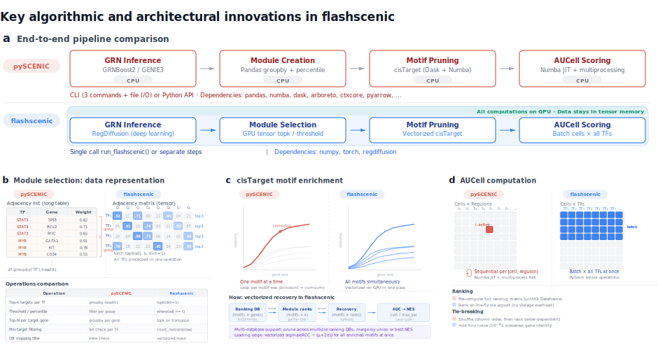

# flashscenic

[](https://opensource.org/licenses/MIT)
[](https://www.python.org/downloads/)

**GPU-accelerated SCENIC workflow for gene regulatory network analysis. Seconds instead of hours.**

flashscenic replaces the bottleneck steps in the [SCENIC](https://scenic.aertslab.org/) pipeline with GPU-powered alternatives: [RegDiffusion](https://github.com/TuftsBCB/RegDiffusion) for GRN inference and vectorized PyTorch implementations of AUCell and cisTarget. The result is a complete GRN analysis pipeline that scales to 20,000 genes and millions of cells, running in seconds on a single GPU.



*Figure: Key algorithmic and architectural innovations in flashscenic compared to pySCENIC.*

## Installation

```bash
pip install flashscenic
```

**Requirements:** Python 3.9+, PyTorch with CUDA support (CPU fallback available), regdiffusion, scipy.

## Quick Start

The simplest way to use flashscenic is through a single pipeline function:

```python
import flashscenic as fs

# exp_matrix: (n_cells, n_genes) log-transformed numpy array
# gene_names: list of gene symbols matching columns
result = fs.run_flashscenic(exp_matrix, gene_names, species='human')

# Results
auc_scores = result['auc_scores']       # (n_cells, n_regulons)
regulon_names = result['regulon_names']  # regulon labels
regulons = result['regulons']            # list of dicts with gene members
regulon_adj = result['regulon_adj']      # (n_regulons, n_genes) adjacency
params = result['parameters']            # dict of all parameters used
```

Required resource files (TF lists, ranking databases, motif annotations) are downloaded automatically on first run.

## Pipeline Parameters

`run_flashscenic` exposes all tunable parameters with stage-based prefixes:

| Prefix | Stage | Key Parameters |
|--------|-------|----------------|
| `grn_` | RegDiffusion | `grn_n_steps`, `grn_sparsity_threshold` |
| `module_` | Module filtering | `module_k`, `module_percentile_thresholds`, `module_top_n_per_target`, `module_min_targets`, `module_min_fraction`, `module_include_tf` |
| `pruning_` | cisTarget | `pruning_rank_threshold`, `pruning_auc_threshold`, `pruning_nes_threshold`, `pruning_min_genes`, `pruning_merge_strategy` |
| `annotation_` | Motif filtering | `annotation_motif_similarity_fdr`, `annotation_orthologous_identity` |
| `aucell_` | AUCell scoring | `aucell_k`, `aucell_auc_threshold`, `aucell_batch_size` |

Example with custom parameters:

```python
result = fs.run_flashscenic(
    exp_matrix, gene_names,
    species='mouse',
    module_k=100,
    module_min_targets=10,
    module_min_fraction=None,  # disable fraction filter
    pruning_nes_threshold=2.5,
    device='cpu',
)
```

## Step-by-Step Usage

For more control, you can run each pipeline step individually. This mirrors what `run_flashscenic()` does internally.

```python
import numpy as np
import torch
import flashscenic as fs

# Step 1: GRN Inference with RegDiffusion
import regdiffusion as rd
trainer = rd.RegDiffusionTrainer(exp_matrix, n_steps=1000, device='cuda')
trainer.train()
adj_matrix = trainer.get_adj()  # (n_genes, n_genes)

# Step 2: Filter to known TFs and sparsify weak edges
known_tfs = set(open('allTFs_hg38.txt').read().split())
tf_indices = [i for i, g in enumerate(gene_names) if g in known_tfs]
tf_names = [gene_names[i] for i in tf_indices]
tf_adj = adj_matrix[tf_indices, :]     # (n_tfs, n_genes)
tf_adj[tf_adj < 1.5] = 0              # zero out weak edges

# Step 3: Create modules (multiple types per TF) and filter
tf_idx_tensor = torch.tensor(tf_indices, device='cuda')
tf_adj_tensor = torch.tensor(tf_adj, dtype=torch.float32, device='cuda')

# Generate different module types from the same adjacency
topk = fs.select_topk_targets(tf_adj_tensor, k=50, tf_indices=tf_idx_tensor)
pct75 = fs.select_threshold_targets(tf_adj_tensor, percentile=75, tf_indices=tf_idx_tensor)
topn5 = fs.select_top_n_per_target(tf_adj_tensor, n=5, tf_indices=tf_idx_tensor)

# For each type, filter TFs with too few targets and extract target indices
modules = []
module_tf_names = []
for type_adj in [topk, pct75, topn5]:
    filtered, tf_mask = fs.filter_by_min_targets(type_adj, min_targets=20)
    for i, keep in enumerate(tf_mask.cpu().numpy()):
        if keep:
            target_indices = torch.where(filtered[i] > 0)[0]
            modules.append(target_indices)
            module_tf_names.append(tf_names[i])

# Step 4: cisTarget pruning (supports multiple databases)
pruner = fs.CisTargetPruner(device='cuda')
pruner.load_database(['db_500bp.feather', 'db_10kb.feather'])
pruner.load_annotations('motifs.tbl', filter_for_annotation=True)
regulons = pruner.prune_modules(modules, module_tf_names, gene_names)
pruner.clear_gpu_memory()

# Step 5: AUCell scoring
regulon_adj = fs.regulons_to_adjacency(regulons, gene_names)
auc_scores = fs.get_aucell(exp_matrix, regulon_adj, k=50, device='cuda')
```

## Resource Files

`run_flashscenic()` requires three resource files: a TF list, ranking databases, and motif annotations. By default these are auto-downloaded from Aertslab on first run and cached in `./flashscenic_data/`.

You can override any of these individually -- unspecified files are still auto-downloaded:

```python
import flashscenic as fs

# Use a custom TF list -- e.g., the curated census from
# Lambert et al. 2018 (https://humantfs.ccbr.utoronto.ca/download.php)
result = fs.run_flashscenic(
    exp_matrix, gene_names,
    species='human',
    tf_list_path='HumanTFs.txt',  # one gene symbol per line
)

# Or override all three for full control
result = fs.run_flashscenic(
    exp_matrix, gene_names,
    tf_list_path='my_tfs.txt',
    ranking_db_paths=['my_db_500bp.feather', 'my_db_10kb.feather'],
    motif_annotation_path='my_annotations.tbl',
)
```

To pre-download the default resources (e.g., for cluster environments without internet):

```python
resources = fs.download_data(species='human', version='v10')
print(resources.tf_list)        # Path to TF list
print(resources.ranking_dbs)    # List of Paths to ranking databases
print(resources.motif_annotation)  # Path to motif annotation file
```

### Supported species and versions

| Species | Version | Source |
|---------|---------|--------|
| human | v10 (recommended), v9 | Aertslab |
| mouse | v10, v9 | Aertslab |
| drosophila | v10 | Aertslab |

## Core API

### Pipeline

| Function | Description |
|----------|-------------|
| `run_flashscenic()` | Full pipeline in one call |
| `regulons_to_adjacency()` | Convert regulons to adjacency matrix |

### Data

| Function | Description |
|----------|-------------|
| `download_data()` | Download cisTarget resource files |
| `list_available_resources()` | List all available resource sets |

### Module Selection

| Function | Description |
|----------|-------------|
| `select_topk_targets()` | Top-k targets per TF |
| `select_threshold_targets()` | Percentile-based target filtering |
| `select_top_n_per_target()` | Top-N regulators per target gene |
| `filter_by_min_targets()` | Filter TFs by minimum target count |
| `filter_by_mapped_fraction()` | Filter TFs by database mapping fraction |
| `select_mixture_model_targets()` | Data-driven selection via Gaussian mixture model |
| `select_knee_targets()` | Data-driven selection via knee/elbow detection |

### cisTarget Pruning

| Function / Class | Description |
|-----------------|-------------|
| `CisTargetPruner` | GPU cisTarget motif pruning (single or multi-database) |
| `MotifAnnotation` | Load and query motif annotation files |

### Scoring and Analysis

| Function | Description |
|----------|-------------|
| `get_aucell()` | GPU-accelerated AUCell scoring |
| `regulon_specificity_scores()` | Regulon Specificity Scores (RSS) per cell type |

## Documentation

Full documentation including a tutorial notebook is available at [docs/](docs/):

- [Installation](docs/installation.md)
- [Quick Start](docs/quickstart.md)
- [Pipeline Guide](docs/pipeline.md) -- detailed parameter tuning
- [API Reference](docs/api.md)
- [Tutorial](docs/tutorial.ipynb) -- end-to-end example with the Immune ALL Human dataset

## Authors

- Hao Zhu (haozhu233@gmail.com)
- Donna Slonim (donna.slonim@tufts.edu)

## License

MIT License. See [LICENSE](LICENSE) for details.
